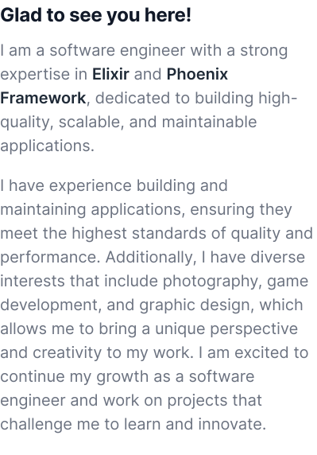

<picture>
  <source
    srcset="img/Headercontent-dark-1.svg"
    media="(min-width:846px) and (prefers-color-scheme: dark)"
  />
  <source
    srcset="img/Headercontent-dark-2.svg"
    media="(min-width:622px) and (prefers-color-scheme: dark)"
  />
  <source
    srcset="img/Headercontent-dark-3.svg"
    media="(prefers-color-scheme: dark)"
  />
  <source
    srcset="img/Headercontent-light-1.svg"
    media="(min-width:846px)"
  />
  <source
    srcset="img/Headercontent-light-2.svg"
    media="(min-width:622px)"
  />
  
</picture>

<picture>
  <source
    srcset="img/Blockcontent-dark-1.svg"
    media="(min-width:846px) and (prefers-color-scheme: dark)"
  />
  <source
    srcset="img/Blockcontent-dark-2.svg"
    media="(min-width:622px) and (prefers-color-scheme: dark)"
  />
  <source
    srcset="img/Blockcontent-dark-3.svg"
    media="(prefers-color-scheme: dark)"
  />
  <source
    srcset="img/Blockcontent-light-1.svg"
    media="(min-width:846px)"
  />
  <source
    srcset="img/Blockcontent-light-2.svg"
    media="(min-width:622px)"
  />
  
</picture>

<a href="https://cal.com/helderbarboza" target="_blank" title="Schedule a call with me">
  <picture>
    <source srcset="img/schedule.svg" media="(prefers-color-scheme: dark)" />
    
  </picture>
</a>
&nbsp;
<a href="https://linkedin.com/in/helderbarboza" target="_blank" title="LinkedIn profile">
  <picture>
    <source srcset="img/linkedin-dark.svg" media="(prefers-color-scheme: dark)" />
    
  </picture>
</a>

